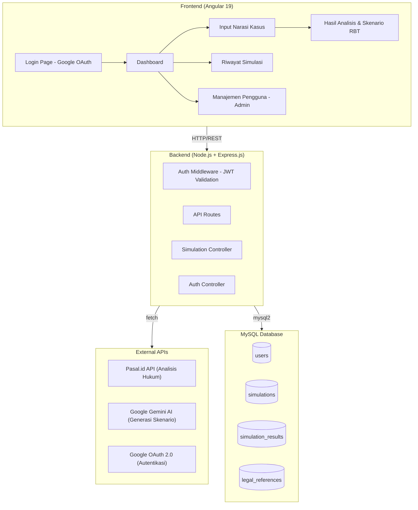

# Web Aplikasi Simulasi Reality-Based Training (RBT)

Aplikasi full-stack untuk Sekolah Polisi Negara (SPN) — Program Pendidikan Pengembangan Spesialisasi (Prolat) bagi anggota Polri. Sistem ini menghasilkan skenario simulasi RBT dari narasi kasus nyata menggunakan analisis hukum otomatis (Pasal.id) dan AI generatif (Google Gemini).

---

## Arsitektur Sistem



---

## Struktur Folder Proyek

```
c:\Users\kresnamukti\Documents\contoh saja\
├── rbt-frontend/                    # Angular 19 Project
│   ├── src/
│   │   ├── app/
│   │   │   ├── core/                # Singleton services, guards, interceptors
│   │   │   │   ├── services/
│   │   │   │   │   ├── auth.service.ts
│   │   │   │   │   ├── simulation.service.ts
│   │   │   │   │   └── history.service.ts
│   │   │   │   ├── guards/
│   │   │   │   │   └── auth.guard.ts
│   │   │   │   └── interceptors/
│   │   │   │       └── auth.interceptor.ts
│   │   │   ├── features/            # Feature modules (lazy-loaded)
│   │   │   │   ├── auth/
│   │   │   │   │   └── login/
│   │   │   │   │       └── login.component.ts
│   │   │   │   ├── dashboard/
│   │   │   │   │   └── dashboard.component.ts
│   │   │   │   ├── simulation/
│   │   │   │   │   ├── input/
│   │   │   │   │   │   └── simulation-input.component.ts
│   │   │   │   │   └── result/
│   │   │   │   │       └── simulation-result.component.ts
│   │   │   │   └── history/
│   │   │   │       └── history.component.ts
│   │   │   ├── shared/              # Shared components, pipes, directives
│   │   │   │   ├── components/
│   │   │   │   │   ├── navbar/
│   │   │   │   │   ├── sidebar/
│   │   │   │   │   └── loading-spinner/
│   │   │   │   └── models/
│   │   │   │       ├── user.model.ts
│   │   │   │       └── simulation.model.ts
│   │   │   ├── app.component.ts
│   │   │   ├── app.config.ts
│   │   │   └── app.routes.ts
│   │   ├── assets/
│   │   │   └── images/
│   │   ├── environments/
│   │   │   ├── environment.ts
│   │   │   └── environment.prod.ts
│   │   ├── styles.css
│   │   └── index.html
│   ├── angular.json
│   ├── package.json
│   └── tsconfig.json
│
├── rbt-backend/                     # Node.js + Express.js Project
│   ├── src/
│   │   ├── config/
│   │   │   ├── db.js                # MySQL connection pool (mysql2)
│   │   │   ├── google-auth.js       # Google OAuth config
│   │   │   └── gemini.js            # Gemini AI client config
│   │   ├── controllers/
│   │   │   ├── auth.controller.js
│   │   │   └── simulation.controller.js
│   │   ├── middleware/
│   │   │   ├── auth.middleware.js    # JWT verification
│   │   │   └── error.middleware.js
│   │   ├── routes/
│   │   │   ├── auth.routes.js
│   │   │   └── simulation.routes.js
│   │   ├── services/
│   │   │   ├── pasal.service.js     # Pasal.id API integration
│   │   │   ├── gemini.service.js    # Gemini AI integration
│   │   │   └── simulation.service.js
│   │   ├── utils/
│   │   │   └── keyword-extractor.js
│   │   └── app.js                   # Express app entry point
│   ├── database/
│   │   └── migrations/
│   │       └── 001_init.sql         # Initial schema
│   ├── .env.example
│   ├── package.json
│   └── README.md
│
└── README.md                        # Project root README
```

---

## Database Schema (MySQL)

```sql
-- users: Menyimpan data pengguna yang login via Google
CREATE TABLE users (
    id INT AUTO_INCREMENT PRIMARY KEY,
    google_id VARCHAR(255) UNIQUE NOT NULL,
    email VARCHAR(255) UNIQUE NOT NULL,
    name VARCHAR(255) NOT NULL,
    picture_url TEXT,
    role ENUM('gadik', 'admin', 'peserta') DEFAULT 'gadik',
    spesialisasi ENUM('reskrim', 'brimob', 'lantas', 'intelkam', 'administrasi') NULL,
    created_at TIMESTAMP DEFAULT CURRENT_TIMESTAMP,
    updated_at TIMESTAMP DEFAULT CURRENT_TIMESTAMP ON UPDATE CURRENT_TIMESTAMP
);

-- simulations: Menyimpan setiap sesi simulasi RBT
CREATE TABLE simulations (
    id INT AUTO_INCREMENT PRIMARY KEY,
    user_id INT NOT NULL,
    judul VARCHAR(500) NOT NULL,
    narasi_kasus TEXT NOT NULL,
    kata_kunci JSON,
    spesialisasi ENUM('reskrim', 'brimob', 'lantas', 'intelkam', 'administrasi') NOT NULL,
    status ENUM('processing', 'completed', 'failed') DEFAULT 'processing',
    created_at TIMESTAMP DEFAULT CURRENT_TIMESTAMP,
    updated_at TIMESTAMP DEFAULT CURRENT_TIMESTAMP ON UPDATE CURRENT_TIMESTAMP,
    FOREIGN KEY (user_id) REFERENCES users(id) ON DELETE CASCADE
);

-- legal_references: Pasal hukum dari Pasal.id API
CREATE TABLE legal_references (
    id INT AUTO_INCREMENT PRIMARY KEY,
    simulation_id INT NOT NULL,
    pasal_number VARCHAR(100) NOT NULL,
    undang_undang VARCHAR(500) NOT NULL,
    deskripsi TEXT,
    ancaman_pidana TEXT,
    raw_response JSON,
    created_at TIMESTAMP DEFAULT CURRENT_TIMESTAMP,
    FOREIGN KEY (simulation_id) REFERENCES simulations(id) ON DELETE CASCADE
);

-- simulation_results: Skenario RBT hasil dari Gemini AI
CREATE TABLE simulation_results (
    id INT AUTO_INCREMENT PRIMARY KEY,
    simulation_id INT NOT NULL,
    skenario_rbt JSON NOT NULL,
    tujuan_pelatihan TEXT,
    peralatan TEXT,
    langkah_langkah JSON,
    evaluasi_kriteria JSON,
    durasi_estimasi VARCHAR(100),
    tingkat_kesulitan ENUM('dasar', 'menengah', 'lanjutan') DEFAULT 'menengah',
    raw_gemini_response JSON,
    created_at TIMESTAMP DEFAULT CURRENT_TIMESTAMP,
    FOREIGN KEY (simulation_id) REFERENCES simulations(id) ON DELETE CASCADE
);
```

---

## Proposed Changes

### Komponen 1: Backend (Node.js + Express.js)

#### [NEW] [rbt-backend/package.json](file:///c:/Users/kresnamukti/Documents/contoh%20saja/rbt-backend/package.json)
- Dependencies: `express`, `mysql2`, `cors`, `dotenv`, `jsonwebtoken`, `google-auth-library`, `@google/generative-ai`, `helmet`, `morgan`, `express-rate-limit`
- Scripts: `start`, `dev` (nodemon)

#### [NEW] [rbt-backend/.env.example](file:///c:/Users/kresnamukti/Documents/contoh%20saja/rbt-backend/.env.example)
- Template environment variables untuk semua API keys dan konfigurasi

#### [NEW] [rbt-backend/src/app.js](file:///c:/Users/kresnamukti/Documents/contoh%20saja/rbt-backend/src/app.js)
- Express server setup dengan CORS, helmet, morgan, rate limiting
- Route registration untuk `/api/auth` dan `/api/simulations`
- Global error handling middleware

#### [NEW] [rbt-backend/src/config/db.js](file:///c:/Users/kresnamukti/Documents/contoh%20saja/rbt-backend/src/config/db.js)
- MySQL connection pool menggunakan `mysql2/promise`
- Connection pooling dengan konfigurasi optimal

#### [NEW] [rbt-backend/src/config/google-auth.js](file:///c:/Users/kresnamukti/Documents/contoh%20saja/rbt-backend/src/config/google-auth.js)
- Google OAuth2Client initialization
- Token verification helper function

#### [NEW] [rbt-backend/src/config/gemini.js](file:///c:/Users/kresnamukti/Documents/contoh%20saja/rbt-backend/src/config/gemini.js)
- GoogleGenerativeAI client initialization
- Model configuration (gemini-1.5-flash / gemini-2.0-flash)

#### [NEW] [rbt-backend/src/controllers/auth.controller.js](file:///c:/Users/kresnamukti/Documents/contoh%20saja/rbt-backend/src/controllers/auth.controller.js)
- `POST /api/auth/google` — Verifikasi Google ID token, create/update user di MySQL, kembalikan JWT
- `GET /api/auth/me` — Ambil profil user dari JWT

#### [NEW] [rbt-backend/src/controllers/simulation.controller.js](file:///c:/Users/kresnamukti/Documents/contoh%20saja/rbt-backend/src/controllers/simulation.controller.js)
- `POST /api/simulations` — **Request berantai (chain):**
  1. Terima narasi kasus dari client
  2. Ekstrak kata kunci dari narasi
  3. Fetch ke Pasal.id API untuk analisis hukum
  4. Kirim narasi + hasil hukum ke Gemini AI untuk generasi skenario RBT
  5. Simpan semua data ke MySQL (simulations, legal_references, simulation_results)
  6. Kembalikan respons lengkap ke frontend
- `GET /api/simulations` — Ambil riwayat simulasi user
- `GET /api/simulations/:id` — Detail simulasi tertentu

#### [NEW] [rbt-backend/src/middleware/auth.middleware.js](file:///c:/Users/kresnamukti/Documents/contoh%20saja/rbt-backend/src/middleware/auth.middleware.js)
- JWT verification middleware
- Attach user info ke `req.user`

#### [NEW] [rbt-backend/src/middleware/error.middleware.js](file:///c:/Users/kresnamukti/Documents/contoh%20saja/rbt-backend/src/middleware/error.middleware.js)
- Centralized error handling
- Error response formatting

#### [NEW] [rbt-backend/src/services/pasal.service.js](file:///c:/Users/kresnamukti/Documents/contoh%20saja/rbt-backend/src/services/pasal.service.js)
- Integrasi dengan Pasal.id REST API (`https://pasal.id/api/v1/search`)
- Bearer token authentication
- Parsing response untuk ekstrak pasal-pasal relevan

#### [NEW] [rbt-backend/src/services/gemini.service.js](file:///c:/Users/kresnamukti/Documents/contoh%20saja/rbt-backend/src/services/gemini.service.js)
- Prompt engineering untuk skenario RBT
- Structured output generation dengan Gemini
- Prompt mencakup: konteks kepolisian, narasi kasus, dasar hukum, spesialisasi

#### [NEW] [rbt-backend/src/services/simulation.service.js](file:///c:/Users/kresnamukti/Documents/contoh%20saja/rbt-backend/src/services/simulation.service.js)
- Business logic orchestrator — menggabungkan Pasal.id + Gemini + MySQL
- Transaction handling untuk konsistensi data

#### [NEW] [rbt-backend/src/utils/keyword-extractor.js](file:///c:/Users/kresnamukti/Documents/contoh%20saja/rbt-backend/src/utils/keyword-extractor.js)
- Ekstraksi kata kunci hukum dari narasi teks Bahasa Indonesia

#### [NEW] [rbt-backend/database/migrations/001_init.sql](file:///c:/Users/kresnamukti/Documents/contoh%20saja/rbt-backend/database/migrations/001_init.sql)
- SQL schema sesuai desain di atas

---

### Komponen 2: Frontend (Angular 19)

#### [NEW] Angular Project via `npx @angular/cli@latest new rbt-frontend`
- Standalone components (Angular 19 default)
- CSS styling (bukan SCSS/Tailwind)
- SSR disabled (SPA only)

#### [NEW] [rbt-frontend/src/styles.css](file:///c:/Users/kresnamukti/Documents/contoh%20saja/rbt-frontend/src/styles.css)
- Design system: CSS custom properties (variables)
- Dark theme dengan aksen biru kepolisian dan gold
- Typography: Google Fonts (Inter/Outfit)
- Glassmorphism effects, gradients, micro-animations
- Responsive grid system

#### [NEW] [rbt-frontend/src/app/core/services/auth.service.ts](file:///c:/Users/kresnamukti/Documents/contoh%20saja/rbt-frontend/src/app/core/services/auth.service.ts)
- Google Sign-In via `google.accounts.id` library
- Kirim ID token ke backend `/api/auth/google`
- Simpan JWT di memory (bukan localStorage, untuk keamanan)
- Auto-refresh session

#### [NEW] [rbt-frontend/src/app/core/guards/auth.guard.ts](file:///c:/Users/kresnamukti/Documents/contoh%20saja/rbt-frontend/src/app/core/guards/auth.guard.ts)
- `canActivate` guard untuk route protection
- Redirect ke login jika belum autentikasi

#### [NEW] [rbt-frontend/src/app/core/interceptors/auth.interceptor.ts](file:///c:/Users/kresnamukti/Documents/contoh%20saja/rbt-frontend/src/app/core/interceptors/auth.interceptor.ts)
- HttpInterceptor untuk attach JWT ke setiap request
- Handle 401 responses

#### [NEW] [rbt-frontend/src/app/features/auth/login/login.component.ts](file:///c:/Users/kresnamukti/Documents/contoh%20saja/rbt-frontend/src/app/features/auth/login/login.component.ts)
- Halaman login dengan tombol "Sign in with Google"
- Desain premium: background gradient, glassmorphism card, logo SPN
- Animasi entrance

#### [NEW] [rbt-frontend/src/app/features/dashboard/dashboard.component.ts](file:///c:/Users/kresnamukti/Documents/contoh%20saja/rbt-frontend/src/app/features/dashboard/dashboard.component.ts)
- Overview statistik: total simulasi, simulasi terbaru
- Quick action cards per spesialisasi (Reskrim, Brimob, Lantas, Intelkam, Administrasi)
- Animated counters, card hover effects

#### [NEW] [rbt-frontend/src/app/features/simulation/input/simulation-input.component.ts](file:///c:/Users/kresnamukti/Documents/contoh%20saja/rbt-frontend/src/app/features/simulation/input/simulation-input.component.ts)
- Form input dengan:
  - Judul simulasi
  - Dropdown spesialisasi
  - Textarea narasi kasus (rich text)
- Submit button dengan loading state
- Real-time progress indicator saat proses chain API berjalan

#### [NEW] [rbt-frontend/src/app/features/simulation/result/simulation-result.component.ts](file:///c:/Users/kresnamukti/Documents/contoh%20saja/rbt-frontend/src/app/features/simulation/result/simulation-result.component.ts)
- Tampilan hasil simulasi:
  - Panel dasar hukum (pasal-pasal dari Pasal.id)
  - Panel skenario RBT dari Gemini (step-by-step)
  - Informasi peralatan, durasi, tingkat kesulitan
  - Kriteria evaluasi
- Print/export to PDF button

#### [NEW] [rbt-frontend/src/app/features/history/history.component.ts](file:///c:/Users/kresnamukti/Documents/contoh%20saja/rbt-frontend/src/app/features/history/history.component.ts)
- Tabel riwayat simulasi dengan pagination
- Filter berdasarkan spesialisasi dan tanggal
- Click untuk lihat detail

#### [NEW] [rbt-frontend/src/app/shared/components/navbar/](file:///c:/Users/kresnamukti/Documents/contoh%20saja/rbt-frontend/src/app/shared/components/navbar/)
- Navigation bar dengan user avatar (Google picture), nama, dan tombol logout

#### [NEW] [rbt-frontend/src/app/shared/components/sidebar/](file:///c:/Users/kresnamukti/Documents/contoh%20saja/rbt-frontend/src/app/shared/components/sidebar/)
- Side navigation: Dashboard, Simulasi Baru, Riwayat
- Collapsible dengan animasi smooth

---

## User Review Required

> [!IMPORTANT]
> **API Keys & Credentials diperlukan sebelum menjalankan aplikasi:**
> - Google Cloud OAuth 2.0 Client ID (buat di [Google Cloud Console](https://console.cloud.google.com/))
> - Pasal.id API Token (daftar di [pasal.id](https://pasal.id))
> - Google Gemini API Key (buat di [Google AI Studio](https://aistudio.google.com/))
> - MySQL database credentials (host, port, user, password, database name)

> [!WARNING]
> **MySQL harus sudah terinstal dan berjalan** di mesin lokal sebelum backend bisa dijalankan. Pastikan juga sudah membuat database sesuai konfigurasi.

> [!NOTE]
> **Pasal.id API** memiliki rate limit. Untuk development, respons akan di-mock jika API token belum dikonfigurasi.

---

## Desain UI

Tema visual aplikasi akan menggunakan:
- **Color Palette**: Dark navy (#0a0f1e) sebagai base, electric blue (#3b82f6) sebagai aksen, gold (#f59e0b) untuk highlight, dengan gradient cyan-to-blue
- **Typography**: Google Fonts "Inter" untuk body, "Outfit" untuk headings
- **Effects**: Glassmorphism pada cards, subtle glow effects, smooth micro-animations
- **Layout**: Sidebar + main content area, fully responsive

---

## Open Questions

> [!IMPORTANT]
> 1. **Apakah Anda sudah memiliki API key/credentials** untuk Google OAuth, Pasal.id, dan Gemini AI? Jika belum, saya akan membuat mock/fallback agar aplikasi tetap bisa dijalankan untuk demo.
> 2. **Apakah MySQL sudah terinstal** di komputer Anda? Jika belum, apakah ingin menggunakan Docker atau instalasi manual?
> 3. **Versi Angular mana yang diinginkan?** Saya merencanakan Angular 19 (terbaru). Apakah ada preferensi lain?

---

## Verification Plan

### Automated Tests
1. Run `npm install` di kedua folder (frontend & backend) — pastikan tidak ada error
2. Run `ng serve` di frontend — pastikan Angular dev server berjalan di `http://localhost:4200`
3. Run `npm run dev` di backend — pastikan Express server berjalan di `http://localhost:3000`
4. Test endpoint `POST /api/auth/google` dengan mock token
5. Test endpoint chain `POST /api/simulations` — verifikasi alur Pasal.id → Gemini → MySQL
6. Buka browser dan verifikasi UI login, dashboard, dan form simulasi

### Manual Verification
- Klik tombol Google Sign-In dan verifikasi flow OAuth
- Input narasi kasus dan verifikasi output skenario RBT
- Verifikasi data tersimpan di MySQL
- Verifikasi responsive design di berbagai ukuran layar
